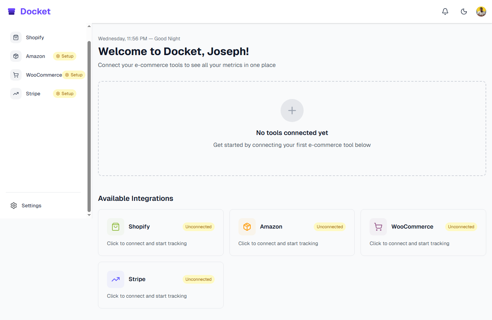
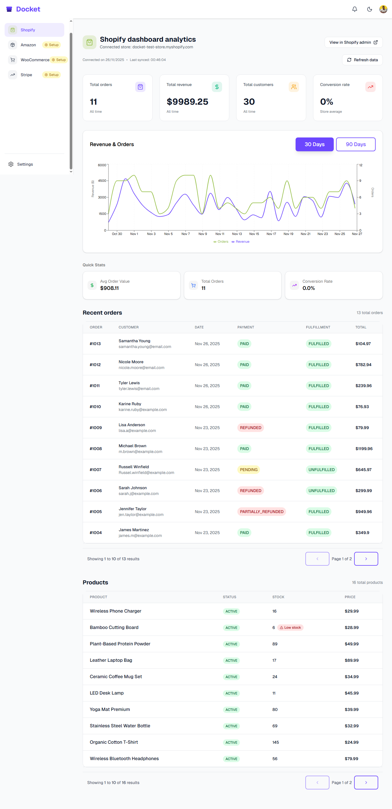
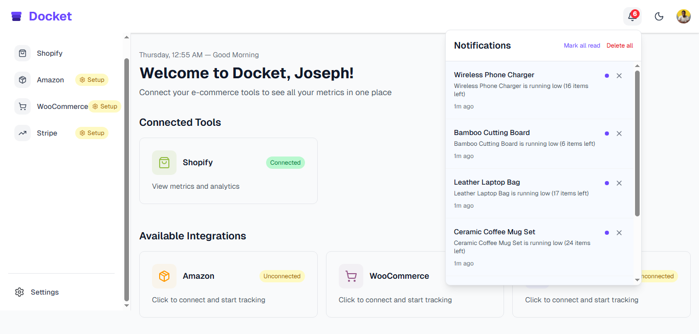
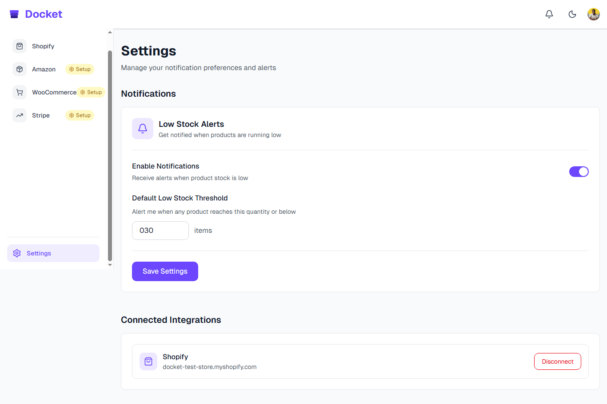

# 🎯 Docket

### Modern Analytics Dashboard for E-commerce Merchants

> **🚀 Building in Public** | A learning project showcasing modern SaaS development with Next.js 15, TypeScript, and Supabase.

[View Demo](https://my-docket.vercel.app) · [Report Bug](https://github.com/JOSEPH-Inalegwu/docket/issues) · [Request Feature](https://github.com/JOSEPH-Inalegwu/docket/issues)

---

## 🎓 About This Project

Docket is an **open-source learning project** where I'm building a complete SaaS analytics platform from scratch. This project demonstrates how to create a production-ready e-commerce dashboard with modern technologies and best practices.

**Why I Built This:**
- 🎯 Master Next.js 15 features (App Router, Server Components, Server Actions)
- 💪 Build a real-world TypeScript application
- 🔐 Implement secure OAuth integrations and token encryption
- 📊 Create a scalable SaaS architecture
- 🌍 Share knowledge with the developer community

**Current Status:** ✅ MVP Complete | 🚧 Adding features | 📢 Building in public

---

## 📋 Overview

Docket is a **unified analytics dashboard** that brings all your e-commerce data into one place. Instead of juggling multiple tools and platforms, merchants get a single, powerful interface to monitor sales, track inventory, and receive intelligent alerts - helping you make faster decisions and prevent stockouts before they impact revenue.

### ✨ Key Features

- **📊 Real-time Analytics Dashboard** - Track orders, revenue, and customer metrics at a glance
- **🔔 Smart Low-Stock Alerts** - Automated notifications with customizable thresholds
- **📦 Inventory Management** - Monitor stock levels across your entire product catalog
- **📈 Revenue Insights** - Interactive charts with 30/90-day revenue trends
- **⚙️ Customizable Thresholds** - Set global or per-product stock alerts
- **🎨 Modern UI/UX** - Clean, responsive design with dark mode support
- **🔐 Secure Authentication** - Enterprise-grade security with encrypted data storage
- **⚡ Lightning Fast** - Built on Next.js 15 with optimal performance

---

## 🎥 Screenshots

### Dashboard Overview

*Real-time analytics and key metrics at your fingertips*

### Shopify Integration

*Comprehensive order and product analytics*

### Low-Stock Notifications

*Smart alerts keep you informed*

### Settings & Integrations

*Easy-to-manage notification preferences*

---

## 🛠️ Tech Stack

### Core Technologies
- **Framework:** [Next.js 15](https://nextjs.org/) (App Router, Server Components)
- **Language:** [TypeScript](https://www.typescriptlang.org/)
- **Styling:** [Tailwind CSS](https://tailwindcss.com/)
- **UI Components:** [shadcn/ui](https://ui.shadcn.com/) (Radix UI primitives)
- **Database:** [Supabase](https://supabase.com/) (PostgreSQL)
- **Authentication:** [Clerk](https://clerk.com/)

### Additional Tools
- **Charts:** [Recharts](https://recharts.org/)
- **Icons:** [Lucide React](https://lucide.dev/)
- **Notifications:** [Sonner](https://sonner.emilkowal.ski/)
- **API Integration:** Shopify Admin API (GraphQL)
- **Security:** AES-256-GCM encryption for token storage

---

## 💡 What I Learned

Key concepts and technologies explored in this project:

### Next.js 15 Deep Dive
- App Router architecture and Server Components
- Server Actions for form handling
- Route handlers for API endpoints
- Middleware for authentication

### TypeScript Best Practices
- Type-safe API clients
- Custom hooks with proper typing
- Interface design for data models
- Generic utility functions

### Security Implementation
- OAuth 2.0 flow with Shopify
- Token encryption (AES-256-GCM)
- Secure environment variable handling
- Database Row Level Security (RLS)

### Database Design
- PostgreSQL schema design
- Relationships and foreign keys
- Efficient queries with indexes
- Real-time subscriptions

### API Integration
- GraphQL queries with Shopify Admin API
- Pagination handling
- Error handling and retries
- Rate limiting considerations

### UI/UX Development
- Responsive design with Tailwind CSS
- Dark mode implementation
- Accessible components with Radix UI
- Interactive data visualizations

---

## 🤝 Contributing

I'm open to collaboration! If you'd like to contribute, feel free to:

- 🐛 Report bugs or issues
- 💡 Suggest new features
- 🔧 Submit pull requests
- 📖 Improve documentation

**How to contribute:**

1. Fork the repository
2. Create a feature branch (`git checkout -b feature/AmazingFeature`)
3. Commit your changes (`git commit -m 'feat: add some AmazingFeature'`)
4. Push to the branch (`git push origin feature/AmazingFeature`)
5. Open a Pull Request

Check the [issues page](https://github.com/JOSEPH-Inalegwu/docket/issues) for open tasks or create a new one!

---

## 📝 License

This project is licensed under the MIT License - see the [LICENSE](LICENSE) file for details.

---

## 👤 Author

**Joseph Inalegwu**

- GitHub: [@JOSEPH-Inalegwu](https://github.com/JOSEPH-Inalegwu)
- LinkedIn: [@Joseph Jonah](https://www.linkedin.com/in/joseph-jonah)
- Twitter: [@JosephOnTech](https://x.com/JosephOnTech)

---

## 🌟 Building in Public

I'm documenting the entire journey of building Docket. Follow along for:

- 📝 Development insights and lessons learned
- 🎯 Weekly progress updates
- 💡 Technical deep-dives
- 🐛 Problem-solving breakdowns

**Connect with me:**
- 💼 [LinkedIn](https://www.linkedin.com/in/joseph-jonah) - Professional updates
- 🐦 [Twitter/X](https://x.com/JosephOnTech) - Daily development progress
- 📧 [Email](mailto:josephjonahinalegwu@gmail.com) - Let's chat!

---

## 🙏 Acknowledgments

Special thanks to the amazing tools and communities that made this possible:

- [Next.js](https://nextjs.org/) - The React Framework for the Web
- [shadcn/ui](https://ui.shadcn.com/) - Beautifully designed components
- [Supabase](https://supabase.com/) - Open source Firebase alternative
- [Clerk](https://clerk.com/) - Authentication and user management
- [Vercel](https://vercel.com/) - Deployment and hosting platform
- [Shopify](https://www.shopify.com/partners) - E-commerce API integration

---

## 📧 Support

Questions or want to chat about the project?

- 💬 [Open an issue](https://github.com/JOSEPH-Inalegwu/docket/issues)
- 📫 [Send me an email](mailto:josephjonahinalegwu@gmail.com)
- 🐦 [DM me on Twitter](https://x.com/JosephOnTech)

---

**Made with ❤️ by [Joseph Inalegwu](https://github.com/JOSEPH-Inalegwu)**

If you find this project helpful, please ⭐ star the repo!

[Report Bug](https://github.com/JOSEPH-Inalegwu/docket/issues) · [Request Feature](https://github.com/JOSEPH-Inalegwu/docket/issues) · [Share Feedback](mailto:josephjonahinalegwu@gmail.com)

